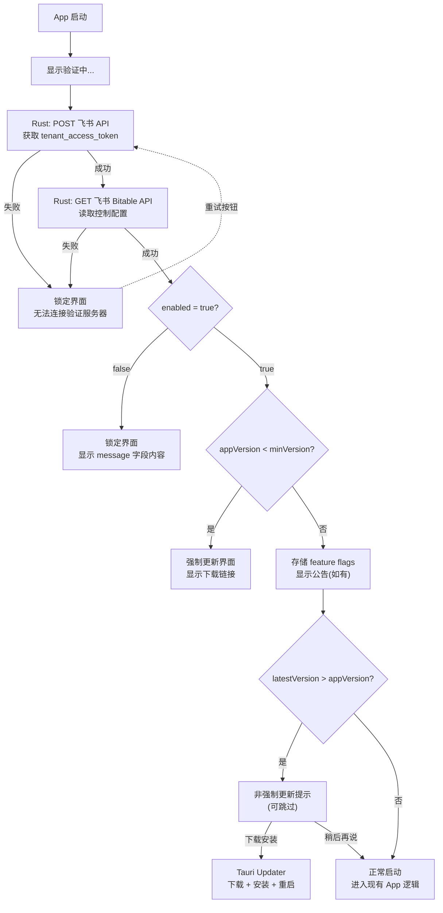
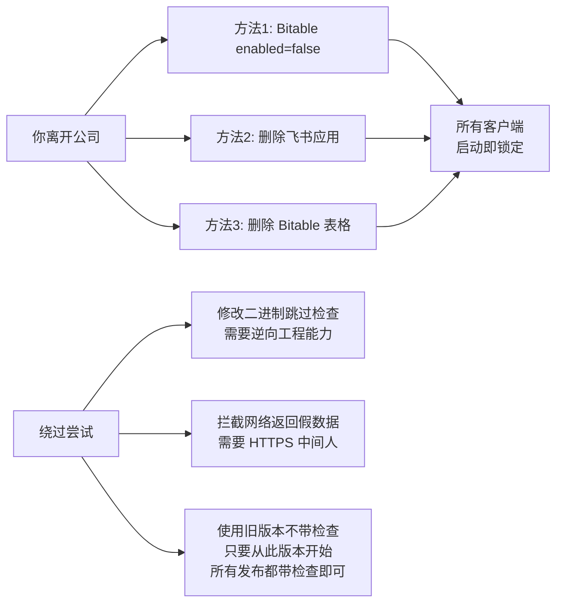

# SkyTrace 自动更新 + 远端控制方案 (飞书版, Fail-Closed)

## 核心设计原则

- **飞书多维表格**作为唯一控制中心 -- 远端配置 + 版本信息都在同一张表里管理
- **Fail-Closed**: 网络请求失败 = 软件锁定（默认状态是"不可用"，只有成功获取到 `enabled=true` 的配置才解锁）
- **无服务器**: 只需飞书个人账号 + 一个文件托管地址（后面详述）
- **手动发布**: 不依赖 CI/CD，本地构建后手动上传

## 整体架构



**关键**: 图中所有"失败"路径都通向锁定界面，没有降级。这意味着当你离开公司后，只要把飞书 Bitable 中的 `enabled` 改为 `false`（或删掉该应用/表），所有客户端即永久锁死。

---

## 一、飞书多维表格：控制中心

### 1.1 前置准备（一次性操作）

**a) 创建飞书开放平台应用**

1. 访问 [open.feishu.cn](https://open.feishu.cn)，用个人飞书账号登录
2. 创建"自建应用" -> 填写名称（如 "SkyTrace 控制台"）
3. 记录 **App ID** 和 **App Secret**
4. 权限管理 -> 搜索添加 `bitable:app:readonly`（多维表格只读）
5. 发布应用（个人账号可自审）

**b) 创建多维表格**

在飞书中新建一个多维表格，设计如下字段：

- `enabled` (复选框) — 总开关 / kill switch
- `min_version` (文本) — 最低允许版本，如 `0.2.0`
- `latest_version` (文本) — 最新版本号，如 `0.3.0`
- `message` (文本) — 锁定时显示的说明
- `update_url_mac` (URL) — macOS 安装包下载地址
- `update_url_win` (URL) — Windows 安装包下载地址
- `update_notes` (文本) — 更新说明
- `features` (文本) — JSON 格式的功能开关，如 `{"skynetQuery":true,"snapshotExport":true}`
- `announcement_text` (文本) — 公告内容（空则无公告）
- `announcement_type` (单选: info / warning / error) — 公告级别

添加**一行记录**填入初始值，然后将飞书应用添加为该表格的协作者（否则 API 无权读取）。

记录 **app_token**（表格 URL 中 `multitable/` 后面的部分）和 **table_id**（表格内具体数据表 ID）。

### 1.2 日常管理方式

直接在飞书 App 或网页上编辑这行记录即可：

- **禁用所有客户端**: 取消勾选 `enabled`，填写 `message`
- **强制升级**: 修改 `min_version` 到新版本号
- **发布新版**: 更新 `latest_version` + `update_url_*` + `update_notes`
- **关闭某功能**: 编辑 `features` JSON 中对应字段为 `false`
- **发公告**: 填写 `announcement_text` + 选择 `announcement_type`

---

## 二、远端控制（Rust 实现）

### 2.1 新建 [src-tauri/src/remote_config.rs](src-tauri/src/remote_config.rs)

核心逻辑：两步 HTTP 请求

```rust
// Step 1: 获取 tenant_access_token
// POST https://open.feishu.cn/open-apis/auth/v3/tenant_access_token/internal/
// Body: { "app_id": "...", "app_secret": "..." }
// 返回: { "tenant_access_token": "t-xxx", "expire": 7200 }

// Step 2: 读取 Bitable 记录
// GET https://open.feishu.cn/open-apis/bitable/v1/apps/{app_token}/tables/{table_id}/records
// Header: Authorization: Bearer {tenant_access_token}
// 返回: records 数组，取第一行，解析各字段
```

数据结构:

```rust
#[derive(Debug, Clone, Serialize, Deserialize)]
#[serde(rename_all = "camelCase")]
pub struct RemoteConfig {
    pub enabled: bool,
    pub min_version: String,
    pub latest_version: String,
    pub message: String,
    pub update_url_mac: String,
    pub update_url_win: String,
    pub update_notes: String,
    pub features: HashMap<String, bool>,
    pub announcement: Option<Announcement>,
}

#[derive(Debug, Clone, Serialize, Deserialize)]
#[serde(rename_all = "camelCase")]
pub struct Announcement {
    pub text: String,
    pub r#type: String, // "info" | "warning" | "error"
}
```

关键实现要点：

- `reqwest` 超时设 **5 秒**（飞书 API 在国内网络通常 <1s）
- **app_id / app_secret / app_token / table_id** 编译进 Rust 二进制（字符串做简单混淆，如 XOR 或 base64 编码，防止直接 strings 命令提取）
- 任何环节失败（网络、解析、飞书 API 报错）都返回 `Err`，**前端收到 Err 即锁定**
- tenant_access_token 有 2 小时有效期；因为只在启动时调一次，无需缓存

### 2.2 新增 Tauri Command

在 [src-tauri/src/commands/mod.rs](src-tauri/src/commands/mod.rs) 中：

```rust
#[tauri::command]
pub async fn check_remote_config() -> Result<RemoteConfig, String> {
    remote_config::fetch_config().await
}
```

在 [src-tauri/src/lib.rs](src-tauri/src/lib.rs) 中注册到 `generate_handler![]`。

### 2.3 凭证安全

飞书 app_secret 编译在二进制中，安全等级分析：

- **足够**: 有人反编译二进制提取 secret -> 只能**读取** Bitable（只读权限）-> 看到的就是公开的配置 -> 无安全风险
- **你的控制权**: 随时可在飞书开放平台**吊销**应用 -> API 立即失效 -> 所有客户端锁死
- **进一步加强（可选）**: 对配置做 HMAC 签名，在 Bitable 中增加一个 `signature` 字段，App 验证后才信任

---

## 三、前端集成

### 3.1 类型定义 ([src/types/index.ts](src/types/index.ts))

```typescript
export interface RemoteConfig {
  enabled: boolean
  minVersion: string
  latestVersion: string
  message: string
  updateUrlMac: string
  updateUrlWin: string
  updateNotes: string
  features: Record<string, boolean>
  announcement: { text: string; type: 'info' | 'warning' | 'error' } | null
}
```

### 3.2 IPC 调用 ([src/services/tauri.ts](src/services/tauri.ts))

```typescript
export async function checkRemoteConfig(): Promise<RemoteConfig> {
  return invoke('check_remote_config')
}
```

### 3.3 Store 扩展 ([src/stores/app.ts](src/stores/app.ts))

```typescript
// 新增状态
const remoteConfig = ref<RemoteConfig | null>(null)
const remoteCheckFailed = ref(false) // 网络失败标记

// 新增 computed
const isRemoteLocked = computed(() =>
  remoteCheckFailed.value || remoteConfig.value?.enabled === false
)

// 新增方法
function featureEnabled(key: string): boolean {
  if (!remoteConfig.value) return false // 默认禁用 (fail-closed)
  return remoteConfig.value.features[key] !== false
}
```

### 3.4 启动流程改造 ([src/App.vue](src/App.vue))

```
onMounted:
  1. 显示 "正在验证..." 全屏 loading
  2. try { remoteConfig = await checkRemoteConfig() }
     catch { remoteCheckFailed = true; return }    <-- fail-closed
  3. if (!remoteConfig.enabled) → 显示锁定界面, return
  4. if (appVersion < remoteConfig.minVersion) → 显示强制更新, return
  5. 正常启动: getAppMode() → 现有快照/loadAll 逻辑
  6. 如果 latestVersion > appVersion → 显示非强制更新提示
  7. 如果有 announcement → 显示公告 banner
```

### 3.5 新增 UI 组件

**a) `src/components/RemoteLockScreen.vue`**

全屏覆盖组件，显示在所有内容之上：

- 网络失败: "无法连接验证服务器，请检查网络后重试" + 重试按钮
- enabled=false: 显示 `message` 字段内容（如 "该软件已停用"）
- version < minVersion: "当前版本过低，请更新" + 下载按钮（链接到 `update_url_*`）

**b) `src/components/AnnouncementBanner.vue`**

页面顶部可关闭的公告条，支持 info(蓝)/warning(黄)/error(红) 三种样式。

**c) `src/components/UpdateDialog.vue`**

非强制更新时的弹窗: 版本号 + 更新说明 + "立即更新" / "稍后再说" 按钮。

---

## 四、自动更新

### 4.1 技术选型

使用 **Tauri plugin-updater** + 自定义端点。Tauri updater 支持任意 HTTP URL 作为更新源，不限于 GitHub。

### 4.2 安装包文件托管选项

由于不能用 GitHub，安装包需要一个**国内可访问的文件下载地址**。推荐优先级：

1. **公司内部文件服务器 / NAS**（如果有 HTTP 访问） -- 零成本
2. **阿里云 OSS / 腾讯云 COS** -- 约 0.12 元/GB/月，几个安装包一年可能 1-2 元
3. **飞书云盘** -- 免费，但下载链接不稳定，需要手动更新 URL（降级方案）

无论哪种方式，需要：
- 一个可直接下载的安装包 URL (`.dmg` / `.msi` / `.nsis`)
- 一个 `latest.json` 清单文件 URL

### 4.3 `latest.json` 格式

这个文件也可以托管在同一个位置，手动维护即可：

```json
{
  "version": "0.2.0",
  "notes": "修复了XX问题，新增YY功能",
  "pub_date": "2026-04-13T00:00:00Z",
  "platforms": {
    "darwin-aarch64": {
      "url": "https://你的文件地址/SkyTrace_0.2.0_aarch64.app.tar.gz",
      "signature": "签名内容(构建时自动生成的 .sig 文件内容)"
    },
    "darwin-x86_64": {
      "url": "https://你的文件地址/SkyTrace_0.2.0_x64.app.tar.gz",
      "signature": "签名内容"
    },
    "windows-x86_64": {
      "url": "https://你的文件地址/SkyTrace_0.2.0_x64-setup.nsis.zip",
      "signature": "签名内容"
    }
  }
}
```

### 4.4 Rust 改动

**a) 依赖** ([src-tauri/Cargo.toml](src-tauri/Cargo.toml)):

```toml
tauri-plugin-updater = "2"
tauri-plugin-process = "2"
```

**b) 生成签名密钥对**:

```bash
npm run tauri signer generate -- -w ~/.tauri/skytrace.key
```

**c) Tauri 配置** ([src-tauri/tauri.conf.json](src-tauri/tauri.conf.json)):

```json
{
  "bundle": {
    "createUpdaterArtifacts": true
  },
  "plugins": {
    "updater": {
      "endpoints": [
        "https://你的文件地址/latest.json"
      ],
      "pubkey": "skytrace.key.pub 的内容"
    }
  }
}
```

**d) 注册插件** ([src-tauri/src/lib.rs](src-tauri/src/lib.rs)):

```rust
.plugin(tauri_plugin_updater::Builder::new().build())
.plugin(tauri_plugin_process::init())
```

**e) 能力声明** ([src-tauri/capabilities/default.json](src-tauri/capabilities/default.json)):

```json
"updater:default",
"process:allow-restart"
```

**f) 前端依赖**:

```bash
npm install @tauri-apps/plugin-updater @tauri-apps/plugin-process
```

### 4.5 前端更新逻辑

在 `App.vue` 启动流程末尾（已通过远端验证后），使用 Tauri updater API:

```typescript
import { check } from '@tauri-apps/plugin-updater'
import { relaunch } from '@tauri-apps/plugin-process'

const update = await check()
if (update) {
  // 显示 UpdateDialog，用户确认后:
  await update.downloadAndInstall((progress) => {
    // 更新进度条
  })
  await relaunch()
}
```

### 4.6 发布流程（手动）

```
1. 修改版本号: package.json + Cargo.toml + tauri.conf.json
2. 本地构建: npm run tauri build
   (设置环境变量 TAURI_SIGNING_PRIVATE_KEY 和 TAURI_SIGNING_PRIVATE_KEY_PASSWORD)
3. 构建产物在 src-tauri/target/release/bundle/ 下
   - macOS: .dmg + .app.tar.gz + .app.tar.gz.sig
   - Windows: .msi + .nsis + .nsis.zip + .nsis.zip.sig
4. 上传 .tar.gz / .nsis.zip 到文件托管
5. 用 .sig 文件内容更新 latest.json 中的 signature
6. 上传 latest.json 到文件托管
7. 更新飞书 Bitable 中的 latest_version + update_url_* + update_notes
```

---

## 五、安全分析：离职后如何确保软件不可用



**实际安全性**: 对于公司内部工具的使用场景，这个方案足够可靠。运维/产品人员通常不具备反编译 Rust 二进制的能力。

**可选加强措施**:
- 在 Bitable 中增加 `signature` 字段，用只有你知道的密钥对配置做 HMAC 签名，App 验证签名后才信任配置内容（防止有人伪造飞书 API 响应）
- 运行时定期检查（每 30 分钟），不仅启动时检查

---

## 六、文件改动清单

### 新建文件

- `src-tauri/src/remote_config.rs` — 飞书 API 调用 + 配置解析
- `src/components/RemoteLockScreen.vue` — 锁定/网络失败/强制更新界面
- `src/components/AnnouncementBanner.vue` — 公告条组件
- `src/components/UpdateDialog.vue` — 非强制更新对话框

### 修改文件

- `src-tauri/Cargo.toml` — 添加 `tauri-plugin-updater`, `tauri-plugin-process`
- `src-tauri/tauri.conf.json` — 添加 updater plugins 配置 + `createUpdaterArtifacts`
- `src-tauri/src/lib.rs` — `mod remote_config;` + 注册 updater/process 插件 + 注册新 command
- `src-tauri/capabilities/default.json` — 添加 `updater:default`, `process:allow-restart`
- `src-tauri/src/commands/mod.rs` — 添加 `check_remote_config` command
- `package.json` — 添加 `@tauri-apps/plugin-updater`, `@tauri-apps/plugin-process`
- `src/services/tauri.ts` — 添加 `checkRemoteConfig()` 调用
- `src/types/index.ts` — 添加 `RemoteConfig`, `Announcement` 接口
- `src/stores/app.ts` — 添加 `remoteConfig` 状态 + `featureEnabled()` + `isRemoteLocked`
- `src/App.vue` — 重构 onMounted: 远端验证 → 现有逻辑 → 更新检查
